# 实战6-自动化口播剪辑（定稿）

> 依据：`实战6_自动化口播剪辑_教程大纲_v0.2.md`（已审核定稿 2026-07-17）。正文 v0.1 经跳蛛先生审核通过，2026-07-17 补齐全部 14 张配图后定稿。
> 配图目录：`docs/images/实战6/`。

---

## 0. 先看成片

▶ 30 秒成片预览：`05_成片/Codex保姆级教学_30s预览版_1080p.mp4`

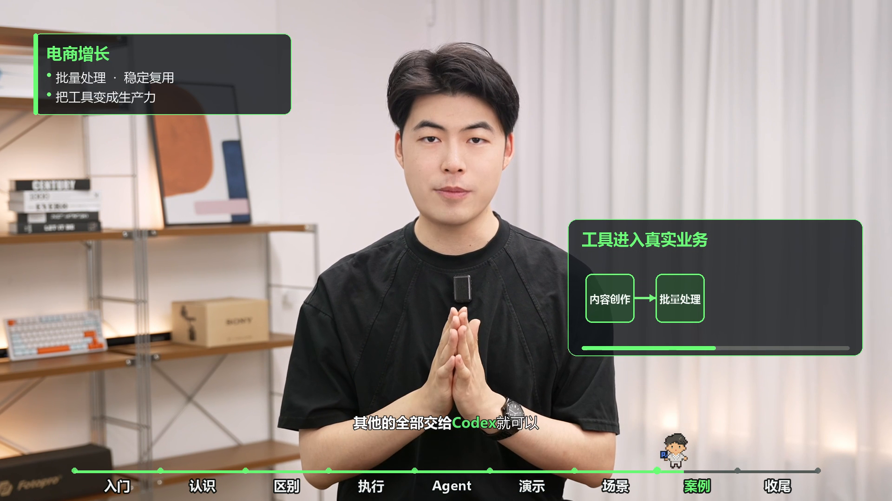

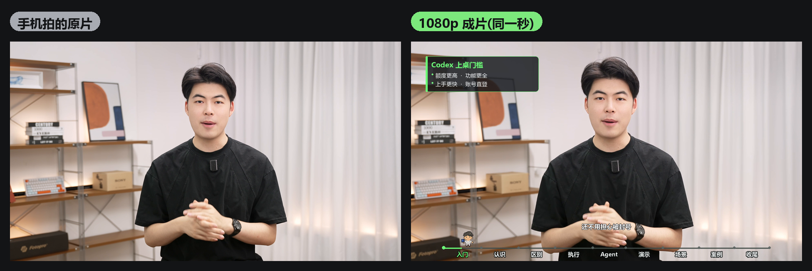

左边是手机拍的口播原片，右边是 1080p 成片：底部字幕、章节进度条、随讲解弹出的信息卡片和图表、实操画面切入——全程没打开过任何剪辑软件。

这一章要教你的玩法就一句话：**装好一套 skill，把素材丢给 Codex，然后在对话里当导演。**你看到的这支教学视频，本身就是这么剪出来的。

## 1. 先认识你的剪辑班底：4 个 skill

剪辑不是 Codex 一个人干的，它背后是一支各管一摊的班底：

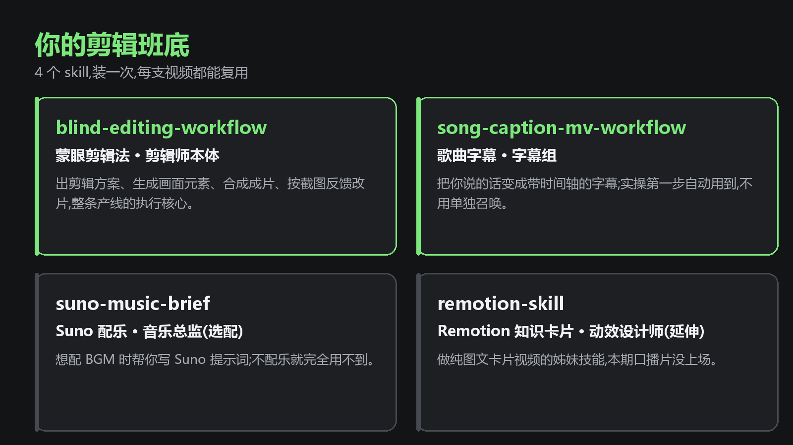

**blind-editing-workflow（蒙眼剪辑法）——剪辑师本体。**整条产线的执行核心：给你出剪辑方案、生成画面元素、合成成片，并且按你的截图反馈改片。这一章你打交道最多的就是它。

**song-caption-mv-workflow（歌曲字幕）——字幕组。**负责把你说的话变成带时间轴的字幕。你不用单独召唤它，剪辑实操第一步会自动用到。

**suno-music-brief（Suno 配乐）——音乐总监，选配。**想给片子配 BGM 时，让它帮你写 Suno 提示词；不配乐就完全用不到它。

**remotion-skill（Remotion 知识卡片）——动效设计师，延伸。**做图文卡片类视频的姊妹技能。本期口播片它没上场，以后想做纯图文视频（没有真人出镜那种）再召唤。

安装方式你在实战 2 已经会了：把素材包发给 Codex，说一句「帮我安装这几个 skill」即可。

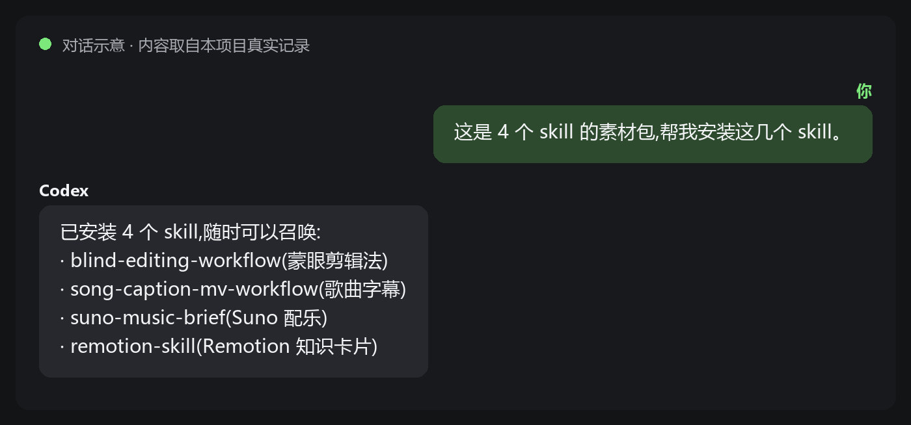

## 2. 剪辑实操：当一次导演

主线一共五步。每一步都是「你说一段话，Codex 给一个结果」——你只负责看和拍板。

### Step 1 · 把素材丢给 Codex，一句话开剪

把原片、口播稿放进项目文件夹，对 Codex 说：

> 这是我的口播原片、口播稿和对标视频，用蒙眼剪辑法帮我剪成教学片。先做字幕识别，用口播稿校对后给我看。

Codex 会自动识别你的语音、再拿口播稿校对一遍，然后把字幕文件给你看。你唯一的活：**通读一遍字幕，改掉错别字。**别偷懒——这份字幕是后面所有画面卡点的时间轴，它错了后面全歪。

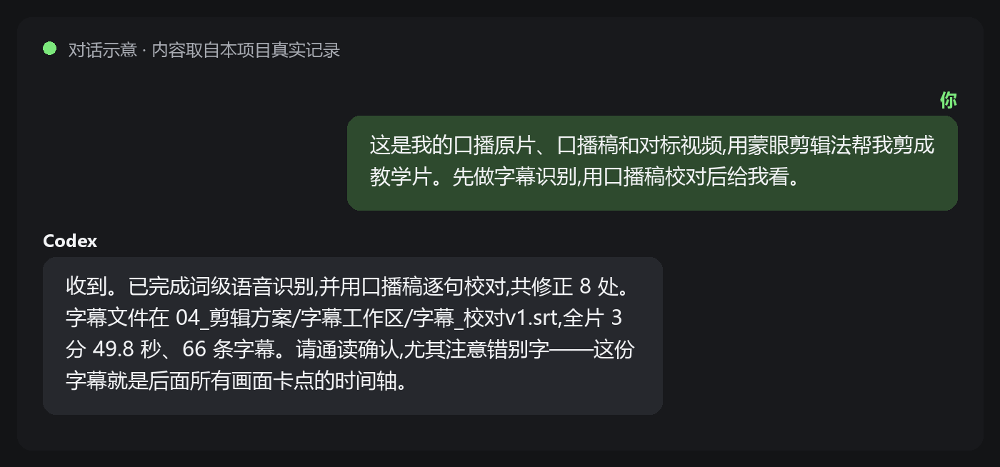

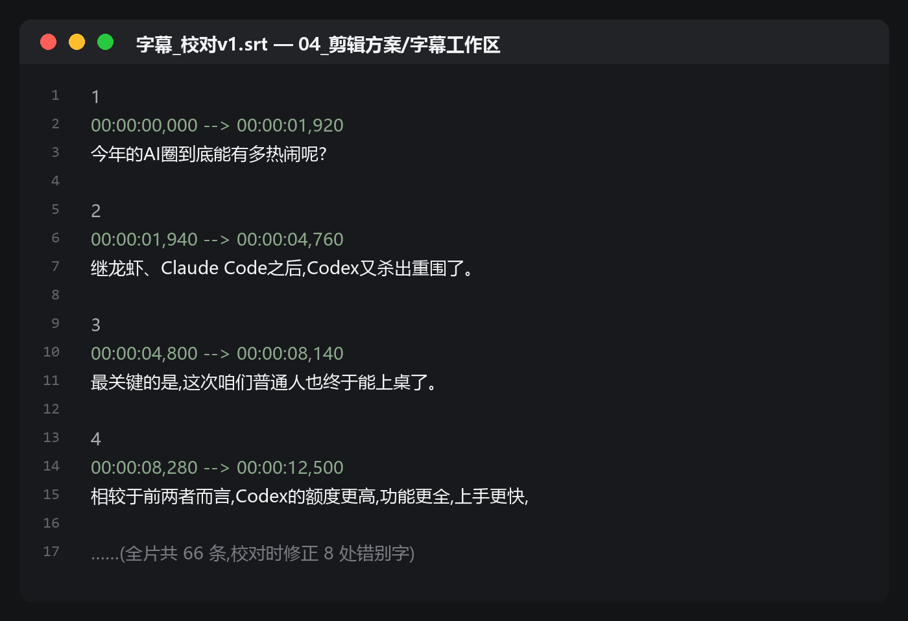

### Step 2 · 审剪辑方案

字幕定了，Codex 会回一份剪辑方案：全片分几章、哪句话配什么卡片、图表、演示画面。你只盯两个审核点：

1. **每个画面是不是真的在讲这句话**——画面和口播对不上的，直接指出来；
2. **章节长短是否大致均匀**——某一章特别长或特别短，让它重新分。

没问题就回一句「确认，开始渲染」。

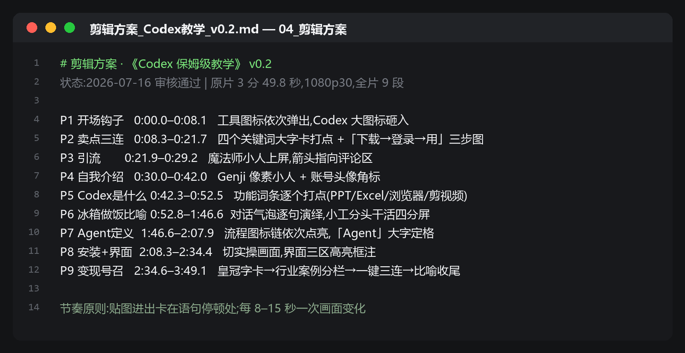

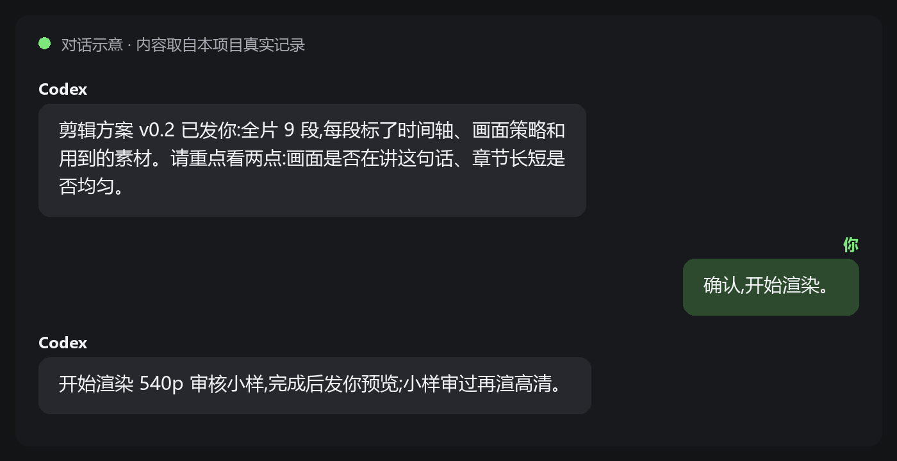

### Step 3 · 看小样

Codex 不会直接渲高清，而是先出一版 540p 的小样给你审——小样审过再渲高清，省时间也省额度。

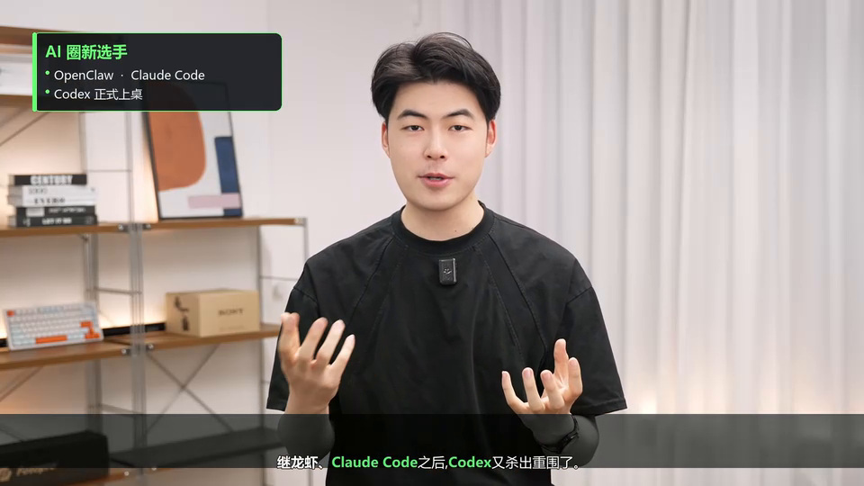

### Step 4 · 截图反馈：导演的核心动作

小样肯定有不满意的地方，这很正常。改片靠一个反馈公式：

> **截图 + 圈出来 + 说想要什么**（哪一秒、哪个元素、改成什么样）

两组本片的真实案例：

**案例一：字幕贴到底边了。**截一张图圈住字幕，说「字幕太靠下了，在底栏里居中」——下一版字幕就位。

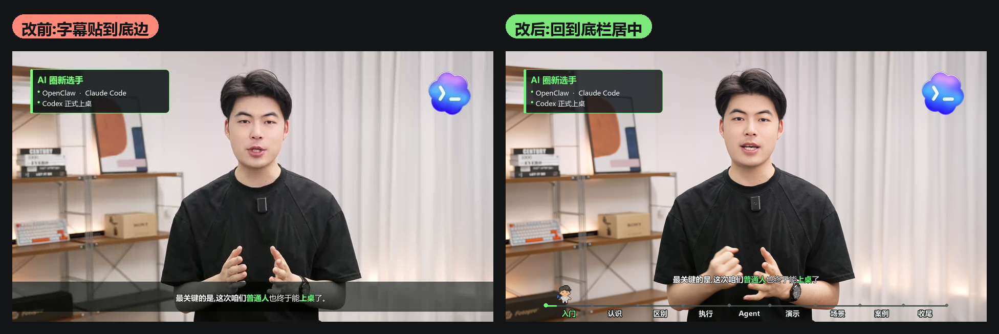

**案例二：流程图挡住人了。**大图表压在画面中间，把讲师整个盖住。截图圈出来，说「图表缩小，移到两侧，别挡人」——下一版图表变小、左右交替出现。

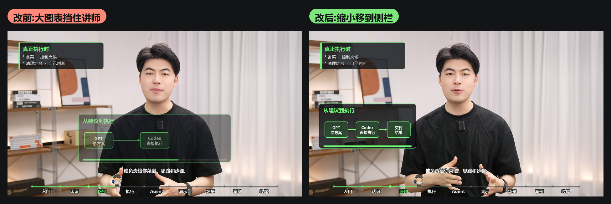

一条迭代纪律：**一次只提一个问题，改完确认了再提下一个。**一口气提五个，改乱了你都不知道是哪条改坏的。

### Step 5 · 成片交付

小样满意后，最后一句话：

> 渲染 1080p 最终版，做完质检后把报告和关键帧截图发我确认。

Codex 会渲染成片、自己做一遍质检，把结论和几张抽帧图发给你。你看抽帧没问题，点头，交付完成。顺手再让它切一段 30 秒预览，发布时当预告用——本章开头那 30 秒就是这么来的。

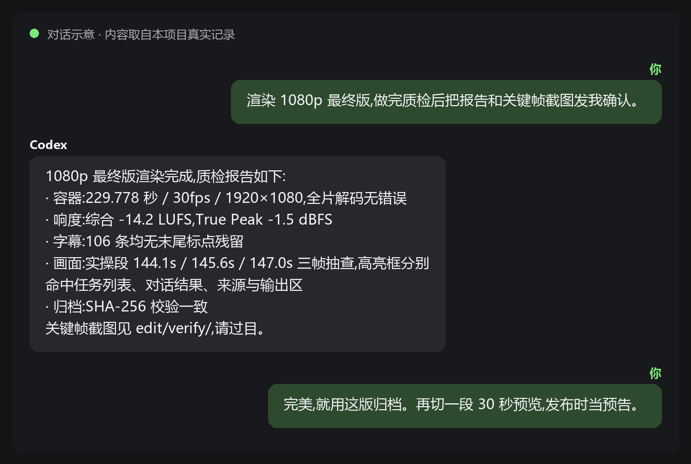

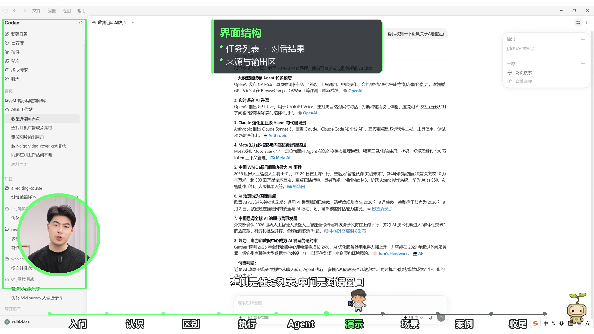

## 3. 这套班底可以复用

skill 装一次就够了。下支口播视频，依然是：丢素材 → 一句话开剪 → 截图当导演。流程跑熟之后，还可以像实战 7 教的那样，把你自己的习惯沉淀成专属 skill——你的班底会越用越懂你。

---

## 结尾卡片 · 开拍前的准备清单

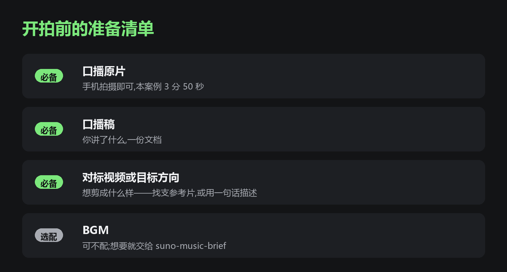

| 必备 | 说明 |
|---|---|
| 口播原片 | 手机拍摄即可，本案例 3 分 50 秒 |
| 口播稿 | 你讲了什么，一份文档 |
| 对标视频或目标方向 | 想剪成什么样——找支参考片，或用一句话描述 |
| BGM（选配） | 可不配；想要就交给 suno-music-brief |

---

## 附：制作侧信息（不进学员版）

- 正文约 1400 字，图 14 张，符合大纲预估（1200-1500 字 + 12-15 张图）。
- 配图制作对照（脚本：会话产物 `make_figs.py`，视觉语言与成片一致——深灰卡片 + 荧光绿强调）：
  - 抽帧类：图1（30s 预览 13.5s 处）、图9（审核预览 v2 · 960×540）、图13（最终版 144.1s 实操段，质检抽帧点）；图2 为原片与最终版同取 12.8s 合成对比。
  - 对比类：图10 = `edit/verify/v2.1字幕位置.jpg` vs 最终版 6.2s；图11 = 成片 v2.4 77.5s（中心大图）vs `edit/verify/v2.4_chart_left.png`。
  - 设计类：图3、图14 按成片 UI 风格代码绘制。
  - 文件截图类：图6 取自真实 `字幕_校对v1.srt` 前 4 条；图7 为 `剪辑方案_Codex教学_v0.2.md` 九段结构速览。
  - 对话类：图4/5/8/12 为**对话示意图**（图内已标注），文字内容取自本项目真实记录（8 处字幕修正、9 段方案、-14.2 LUFS 等数据均来自复盘文档与方案文档）；若后续在 Codex 中重演补录真实界面截图，可直接同名替换。
- 事实来源：`edit/kb_sync/2026-07-16_Codex保姆级教学_代码化口播剪辑完整复盘.md` + `04_剪辑方案/剪辑方案_Codex教学_v0.2.md` + git 提交历史；两组反馈案例均为项目真实迭代记录。
